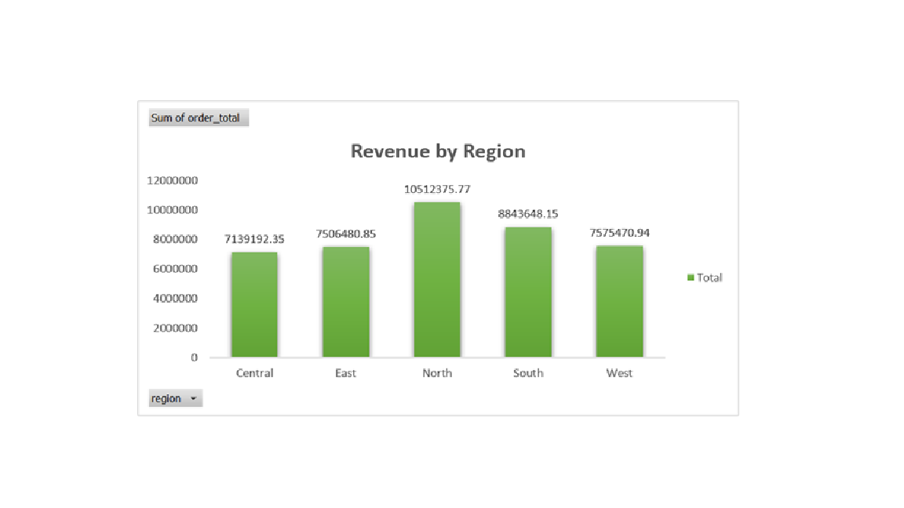
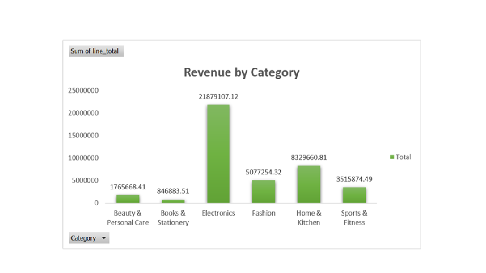
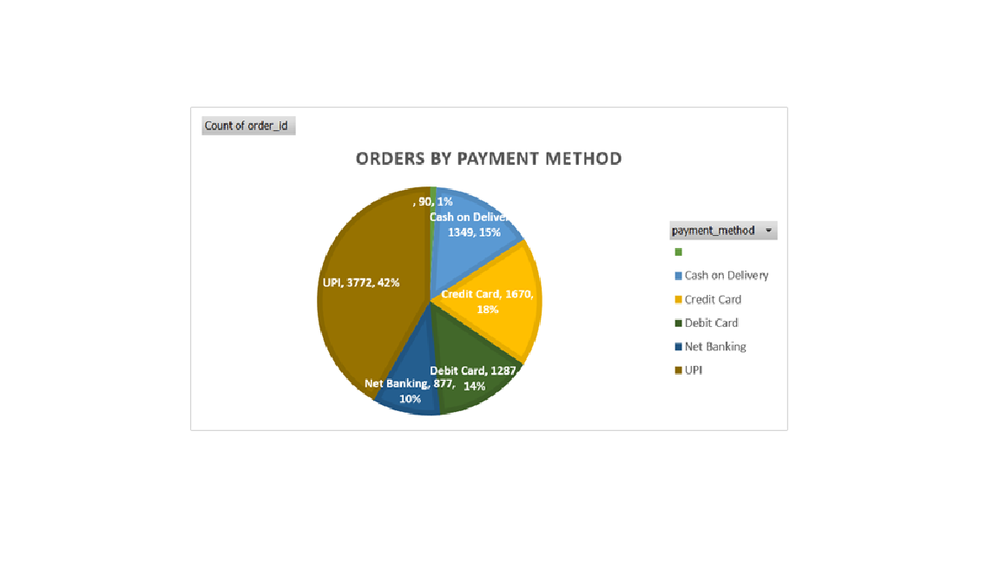
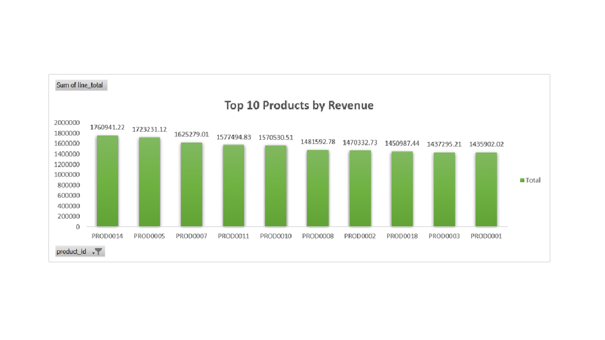
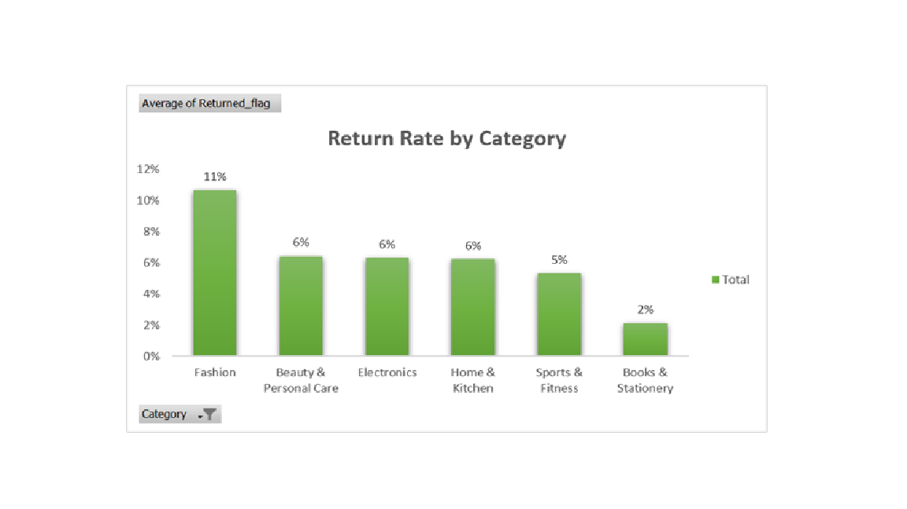

# Excel Sales Dashboard — E-commerce Analysis
**Author:** Sneha 👩‍💻
An interactive Excel dashboard built on a multi-table e-commerce dataset, using **Pivot Tables, Pivot Charts, and VLOOKUP** to analyze sales performance across regions, categories, payment methods, products, and returns.
## Dataset
The workbook contains 4 related tables imported from CSV, spanning **Jan 2024 – Dec 2025**:
| Table | Rows | Description |
|---|---|---|
| Customers | 1,200 | Region, city, segment, signup date |
| Products | 108 | 6 categories, pricing, cost |
| Order | 9,045 | Order-level totals, region, payment method, returns |
| Order_Items | 16,943 | Line-item level detail (quantity, discount, returns) |
## Approach
1. **Data Import** — connected all 4 CSVs into one workbook using Excel's Get & Transform (Power Query).
2. **VLOOKUP** — pulled category from the Products table into Order_Items, so line-item revenue could be analyzed by category.
3. **Helper Column** — created a Returned_flag column (=IF(is_returned=TRUE,1,0)) to calculate return rate using Average in a Pivot Table.
4. **Pivot Tables & Pivot Charts** — built 5 separate pivot tables, each summarizing a different business question, and visualized each as a styled chart with data labels.
## Key Insights
- **North** region generates the highest revenue (₹1.05 Cr of ₹4.16 Cr total)
- **Electronics** is the top-performing category by revenue (₹2.19 Cr), more than 5x the next closest category (Home & Kitchen)
- **UPI** is the most-used payment method (3,772 of 9,045 orders — 42%)
- Best-selling single product by revenue: **PROD0014** (₹17.6 L)
- **Fashion** has the highest return rate at **11%**, well above the overall average of 7%
## Visuals
**Revenue by Region**

**Revenue by Category**

**Orders by Payment Method**

**Top 10 Products by Revenue**

**Return Rate by Category**

## Tools Used
Microsoft Excel · Pivot Tables · Pivot Charts · VLOOKUP · Power Query (Get Data)
## Files
- `Ecommerce_Sales_Excel_Dashboard.xlsx` — full workbook with data, pivot tables, and charts
- `chart_*.png` — screenshots of each pivot chart
